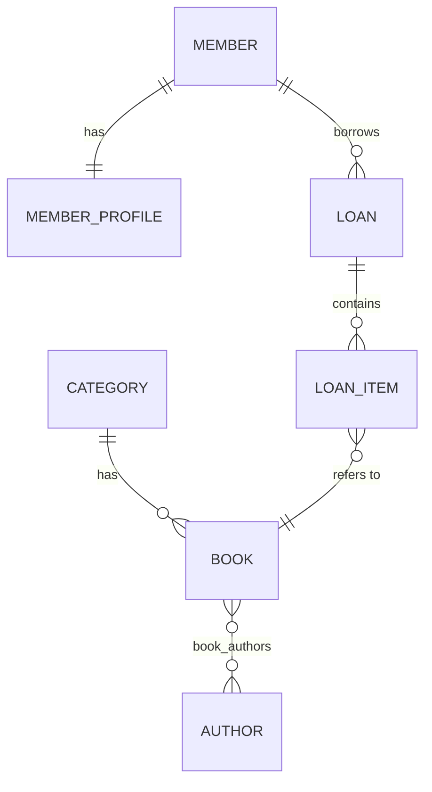

# BookNest — Library Lending System

A console back-office application for a training-center library, built with
**plain JPA + Hibernate ORM** (no Spring / Spring Data).

> Status: All 6 tasks complete.

---

## 1. Tech Stack

| Concern | Choice |
|---|---|
| Language | Java 17 |
| Build tool | Maven |
| ORM | Hibernate ORM 6.5 (Jakarta Persistence 3.1) |
| Database | H2, file mode (`./data/booknestdb`) |
| Validation | Hibernate Validator (Jakarta Bean Validation) |
| Logging | SLF4J + Logback |

## 2. Setup & Run

Prerequisites: JDK 17+, Maven 3.9+.

```bash
# compile
mvn compile

# run the console app
mvn exec:java -Dexec.mainClass=com.booknest.app.Main
```

On first run, pick menu option **24) Seed sample data** to populate 3
categories, 3 authors, 3 books, 2 members, and one sample loan — this is
the "sample data / seed method" required by Task 6, and the fastest way
for a grader to explore every flow without typing everything by hand.
Re-running it is safe: duplicate ISBN/email are caught and reported
instead of crashing the app.

The H2 file database is created automatically on first run at `./data/booknestdb.mv.db`.
Delete that file (and `./data/booknestdb.trace.db` if present) to reset the schema/data.

Registering a member (menu **8**) always creates the matching `MemberProfile`
in the same transaction (address is optional, `joinedAt` is stamped
automatically) — this exercises the `Member` 1-1 `MemberProfile`
relationship end to end, not just at the mapping level. Use menu **25) View
member detail (with profile)** to load a member together with its profile
via a fetch-join query and see `address` / `joinedAt`.

## 3. Database Configuration

Configured entirely in `src/main/resources/META-INF/persistence.xml`, persistence
unit `bookNestPU`:

- `hibernate.hbm2ddl.auto=update` — convenient during development; the schema
  is updated to match the entity mappings on each startup. This is **not** a
  migration tool — see the Performance/Config note in Task 5 for why a real
  project would move to `validate` + versioned SQL scripts instead.
- `hibernate.show_sql` / `hibernate.format_sql` — SQL is printed to the
  console so query counts and shapes can be inspected (needed for the N+1
  analysis in Task 5).
- `hibernate.default_batch_fetch_size=20` — set from the start so lazy
  collection loading batches by default rather than falling back to one
  query per row; this will be revisited explicitly in Task 5.

## 4. Primary Key Generation Strategy

All entities use:

```java
@Id
@GeneratedValue(strategy = GenerationType.IDENTITY)
```

**Why `IDENTITY` and not `SEQUENCE`:** the project targets H2 (and the same
code should also run unmodified against MySQL, one of the allowed databases).
`IDENTITY` maps directly to a native auto-increment column on both, keeps the
mapping simple to reason about for every entity, and avoids the extra
`allocationSize`/sequence-object configuration that `SEQUENCE` needs. The
known trade-off — Hibernate must insert a row immediately to learn its
generated id, which limits JDBC batching of inserts — is acceptable here
because BookNest is a low-volume back-office console app, not a
high-throughput bulk-insert system. If the target database were PostgreSQL
and insert throughput mattered, `SEQUENCE` with a larger `allocationSize`
would be the better choice.

## 5. Schema / Entity Overview

### Entity-relationship diagram



If your viewer doesn't render Mermaid, the same shape as plain text:

```text
Category  1 -----* Book  *-----* Author   (join table book_authors)
Member    1 -----1 MemberProfile
Member    1 -----* Loan  1-----* LoanItem *-----1 Book
```

### Tables

| Entity | Table | Notes |
|---|---|---|
| `Book` | `books` | unique `isbn`, `status` as `EnumType.STRING` |
| `Author` | `authors` | |
| `Category` | `categories` | unique `name` |
| `Member` | `members` | unique `email` |
| `MemberProfile` | `member_profiles` | |
| `Loan` | `loans` | `status` as `EnumType.STRING` |
| `LoanItem` | `loan_items` | |

All dates use `java.time` (`LocalDate` / `LocalDateTime`), all enums use
`EnumType.STRING` (safer than ordinal — see unit 03), and money/decimal
fields (not needed yet in this schema) would use `BigDecimal` per course
convention.

## 5b. Relationships (Task 2)

| Relationship | Owning side | Cascade | orphanRemoval | Why |
|---|---|---|---|---|
| `Member` 1--1 `MemberProfile` | `MemberProfile` (FK `member_id`, unique) | `ALL` (from Member) | `true` | A profile has no meaning without its member. |
| `Member` 1--* `Loan` | `Loan` (FK `member_id`) | `PERSIST, MERGE` only (from Member) | `false` | Loans are historical records; removing a member must never silently delete loan history. |
| `Loan` 1--* `LoanItem` | `LoanItem` (FK `loan_id`) | `ALL` (from Loan) | `true` | A loan item has no meaning without its loan (same pattern as Order/OrderItem in the course material). |
| `LoanItem` *--1 `Book` | `LoanItem` (FK `book_id`) | none | n/a | Book is shared catalog data, independent lifecycle. |
| `Book` *--1 `Category` | `Book` (FK `category_id`) | none | n/a | Category is shared lookup data. |
| `Book` *--* `Author` | `Book` (join table `book_authors`) | none (explicitly **no** `REMOVE`) | n/a | Authors/books are both shared; cascading remove could delete a book or author still referenced elsewhere. |

All `@ManyToOne` / `@OneToOne` associations are explicitly set to
`FetchType.LAZY` (overriding the JPA default of `EAGER`), per the course
recommendation in unit 02/05 — eager-by-default is what causes hidden N+1
and over-fetching later.

Bidirectional in-memory sync is done through helper methods only
(`member.addLoan(...)`, `loan.addItem(...)`, `book.addAuthor(...)`,
`member.setProfile(...)`) — the raw relationship setters are package-private
where possible so callers can't update only one side by mistake.

`toString()` on every entity stays shallow (no relationship traversal) to
avoid recursive bidirectional printing/logging.

## 5c. Queries & Reports (Task 4)

| Use case | Location | Technique |
|---|---|---|
| Find book by ISBN | `BookRepository.findByIsbn` | JPQL, named parameter |
| Search books by title keyword | `BookRepository.searchByTitleKeyword(Paged)` | JPQL `like`, pagination |
| List books by category | `BookRepository.findByCategory` / `@NamedQuery Book.findByCategoryName` | JPQL implicit join / NamedQuery |
| List books by author | `BookRepository.findByAuthor` / `@NamedQuery Book.findByAuthorName` | JPQL explicit `join` + `distinct` / NamedQuery |
| Active loans for a member email | `LoanRepository.findActiveLoansByMemberEmail` | JPQL `join l.member` |
| Overdue loans | `LoanRepository.findOverdueLoans` | `@NamedQuery Loan.findOverdue` |
| Loan detail (member + items + books) | `LoanRepository.findDetailById` | JPQL fetch join (see Task 5) |
| Top borrowed books | `LoanRepository.topBorrowedBooks` | JPQL `group by` + DTO projection `TopBorrowedBook` |
| Count loans by status | `LoanRepository.countByStatus` | JPQL `group by` + DTO projection `LoanStatusCount` |
| Dynamic book search (keyword/category/author/availability) | `BookRepository.searchDynamic` | Criteria API, optional predicates, paginated |

All list queries have deterministic `order by` so pagination (`setFirstResult`/`setMaxResults`) returns stable pages.

## 6. Feature Checklist

- [x] **Task 1** — Maven project, `persistence.xml`, 7 entities with explicit
  table/column names, unique constraints, `IDENTITY` PK strategy explained above.
- [x] **Task 2** — All relationships mapped (table above), Bean Validation
  annotations on every entity, `ValidationUtil` for manual validation in
  this plain-JPA console app, no `CascadeType.REMOVE` on the `Book`–`Author`
  many-to-many. `Member` 1-1 `MemberProfile` is not just mapped but
  actually exercised: `MemberService.register(...)` creates the profile in
  the same transaction (cascading from `Member`), and menu **25** loads it
  back with a fetch join.
- [x] **Task 3** — Console menu (`ConsoleApp`) covering categories, authors,
  books, members (including their profile), lending, and returns. Lending
  is one atomic transaction (`LendingService.lendBooks`, via the `Tx`
  helper): any unknown book, non-positive quantity, or insufficient stock
  rolls back the whole loan. Custom exceptions: `BookNotFoundException`,
  `MemberNotFoundException`, `InsufficientCopiesException`,
  `InvalidInputException`, `DataAccessException`, plus
  `LoanNotFoundException` for a coherent return/detail flow.
- [x] **Task 4** — JPQL joins (category/author/member), 2 pagination-backed
  list/search methods, 3 `@NamedQuery` (`Book.findByCategoryName`,
  `Book.findByAuthorName`, `Loan.findOverdue`), one Criteria API dynamic
  search (`BookRepository.searchDynamic`, filters: keyword, category,
  author, availability), 2 DTO projections (`TopBorrowedBook`,
  `LoanStatusCount`).
- [x] **Task 5** — N+1 scenario reproduced and fixed (see below), explicit
  `@BatchSize(20)` on `Loan.items` / `Member.loans` in addition to the
  global `hibernate.default_batch_fetch_size`, first-level cache
  demonstrated with two `em.find()` calls, decision documented on
  second-level cache (not enabled — see below).
- [x] **Task 6** — This README (setup, schema/ER diagram, PK rationale,
  performance notes, first-level cache note, full checklist), seed
  method (`SeedData`, menu option 24), no dead/debug code (`Main` is a
  one-line entry point into `ConsoleApp`; grepped for `TODO`/`FIXME`/
  stray `printStackTrace` — none found).

## 7. Performance Notes

### Lazy vs eager — summary of decisions

Every `@ManyToOne` and `@OneToOne` in this project is explicitly set to
`FetchType.LAZY`, overriding the JPA default of `EAGER` for those
associations (see the table in section 5b). Every `@OneToMany` /
`@ManyToMany` is `LAZY` as well, which is already the JPA default for
collections. In short: **nothing loads eagerly by default**; each use case
fetches what it actually needs, either through navigation inside an open
transaction, an explicit fetch join, or a DTO projection.

### N+1 scenario reproduced

Run from the console menu:

```
21) [Perf] N+1 demo (naive)
```

This calls `LoanRepository.findAllNaive()` — plain `select l from Loan l`,
no fetch join — and then, for each loan, touches `loan.getMember()` and
`loan.getItems()` / `item.getBook()`. Watch `hibernate.show_sql` in the
console:

- **1** query loads the list of loans.
- Then, as the lazy `member` and `items`/`book` associations are first
  touched, **additional** queries run to fill them in.

Because `hibernate.default_batch_fetch_size=20` (persistence.xml) and
`@BatchSize(20)` (on `Loan.items` and `Member.loans`) are already
configured, Hibernate batches these lazy loads into groups of up to 20
(`... where loan_id in (?, ?, ...)`) instead of one query per row — so with
a small number of loans you may only see 2-3 extra SELECTs, not one per
loan. The *shape* of the problem is still N+1: **the query count grows
with the number of loans touched**, which is exactly the symptom described
in unit 05 §5 ("count statements... increase test data and see if query
count grows linearly").

### Optimized version

Run from the console menu:

```
22) [Perf] Fetch join demo (optimized)
```

This calls `LoanRepository.findAllWithDetails()`:

```java
select distinct l
from Loan l
join fetch l.member
left join fetch l.items i
left join fetch i.book
order by l.id
```

Exactly **ONE** SQL statement runs, regardless of how many loans, items,
or books exist. This is the same fetch-join technique already used by
`findDetailById` (Task 3/4) for the "view loan detail" and "return loan"
flows.

**Why fetch join here and not DTO projection:** the loan-listing use case
still needs managed `Loan`/`LoanItem`/`Book` objects (e.g. for the return
flow, which mutates `Book.availableCopies`), so a DTO projection would
just require re-fetching the entities anyway. DTO projection is used
instead for the two *read-only* reports that never need managed entities:
`TopBorrowedBook` and `LoanStatusCount` (Task 4).

## 8. First-Level Cache Demonstration

Run from the console menu:

```
23) [Perf] First-level cache demo
```

`PerformanceDemo.runFirstLevelCacheDemo(bookId)` calls `em.find(Book.class,
bookId)` **twice** inside the same persistence context (same
`EntityManager`, same transaction):

```java
Book first  = em.find(Book.class, bookId);
Book second = em.find(Book.class, bookId);
System.out.println(first == second); // true
```

The SQL log shows **one** SELECT, not two: the second `find` is served
entirely from the first-level cache (the persistence context itself), and
`first == second` prints `true` — both variables reference the exact same
managed Java object. This cache disappears the moment the `EntityManager`
closes; it is not shared across requests/use cases (unit 05 §7).

## 9. Second-Level Cache — decision

**Not enabled for this submission.** Reasoning:

- The course material (unit 05 §12, "Common Mistakes") explicitly warns
  against *"enabling second-level cache before fixing N+1 queries"* —
  N+1 was the higher-priority problem and is now fixed via fetch join /
  batch fetching above.
- `Category` is the obvious candidate (small, read-mostly, referenced by
  many `Book`s), but BookNest is a low-traffic, single-process console
  app with one shared H2 file database. There is no second application
  instance to benefit from a *shared* cache, and no concurrent load that
  makes repeated `Category` lookups a measured bottleneck.
- Enabling it would add a caching provider dependency (e.g. Ehcache) and
  configuration (`hibernate.cache.use_second_level_cache`,
  `@Cacheable`, `@Cache(usage = CacheConcurrencyStrategy.READ_WRITE)` on
  `Category`) that this project cannot currently exercise or verify
  under load, and stale-data/invalidation behavior would be untested.
- If BookNest were extended to a multi-instance service with heavy,
  repeated `Category` lookups, enabling second-level cache on `Category`
  specifically (not on frequently-changing entities like `Loan` or
  `Book.availableCopies`) would be the correct next step, exactly per the
  "when it helps" guidance in unit 05 §8.